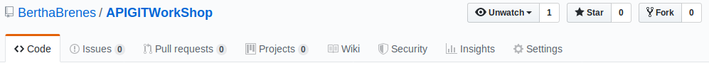
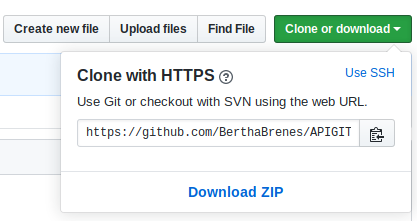

1. create an account if you dont have

2. Fork my this repo

3. Clone your repo in your profile

4. Change something, create a file, whatever you want

5. In your terminal type

   $ git add .

   $ git commit -m "[action] explanation of the action"
    
    $ git push
